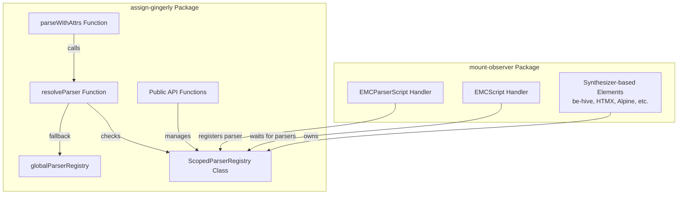
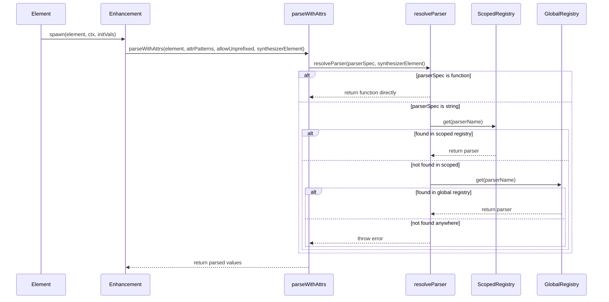
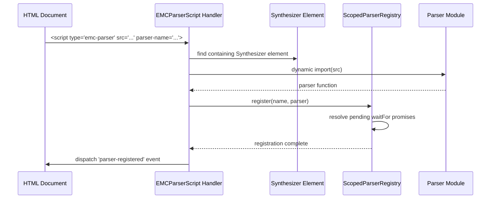
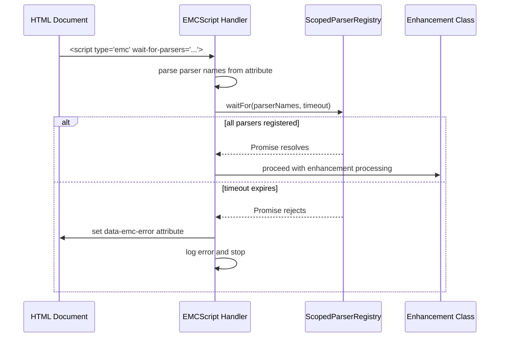

# Design Document: Scoped Parser Registry

## Overview

This design implements a scoped parser registry system that enables lazy-loading of complex parsers for enhancement attributes while maintaining framework isolation. The system spans two packages:

- **assign-gingerly**: Core parser registry, resolution logic, and parseWithAttrs integration
- **mount-observer**: EMC parser script handler and parser waiting mechanism

### Key Design Goals

1. **Framework Isolation**: Each synthesizer element maintains its own parser registry to prevent conflicts between different framework libraries
2. **Lazy Loading**: Complex parsers are loaded on-demand via declarative or programmatic APIs
3. **Backward Compatibility**: Existing inline parser functions continue to work unchanged
4. **Clear Context Flow**: The "murky" challenge of threading synthesizer context through enhancement initialization is solved via explicit parameter passing

### Critical Design Challenge: Context Threading

**The Problem**: During enhancement instantiation, the deep innards of assign-gingerly's parseWithAttrs function need to access the scoped registry associated with the synthesizer element (be-hive). However, the synthesizer element is NOT necessarily a DOM ancestor of the enhanced element:

- **Outside Shadow DOM**: The be-hive is a sibling that syndicates EMC scripts
- **Inside Shadow DOM**: The be-hive is inside the shadow root, but EMC scripts are pulled from the root document

The enhanced element and the be-hive may be in completely different parts of the DOM tree.

**The Solution**: Instead of traversing the DOM tree, we pass the synthesizer element context through the enhancement configuration and initialization chain:

```
EMCScript.handleMount(scriptElement)
  → scriptElement is inside a be-hive element
  → Read emc.json configuration
  → Store synthesizerElement reference in enhancement config
  → When element matches enhancement:
    → element.enh.get(enhancementConfig) 
      → SpawnClass constructor(element, ctx, initVals)
        → ctx.synthesizerElement contains the be-hive reference
        → parseWithAttrs(element, attrPatterns, allowUnprefixed, ctx.synthesizerElement)
          → resolveParser(parserSpec, ctx.synthesizerElement)
            → scopedRegistry.get(parserName)
```

The synthesizer element is determined by the EMCScript handler - it's the be-hive element that contains (or subscribes to) the EMC script being processed. This reference is stored in the enhancement configuration and passed through the spawn context (ctx).

## Architecture

### High-Level Component Diagram



### Parser Resolution Flow



### EMC Parser Loading Flow



### EMC Script Parser Waiting Flow



## Components and Interfaces

### ScopedParserRegistry Class

**Location**: `assign-gingerly/ScopedParserRegistry.ts`

**Purpose**: Manages parser registrations for a single be-hive scope with Promise-based waiting.

```typescript
export class ScopedParserRegistry {
  private parsers: Map<string, (v: string | null) => any>;
  private pendingWaits: Map<string, Array<{
    resolve: () => void;
    reject: (error: Error) => void;
  }>>;
  
  /**
   * Register a parser with a given name
   */
  register(name: string, parser: (v: string | null) => any): void;
  
  /**
   * Get a parser by name
   */
  get(name: string): ((v: string | null) => any) | undefined;
  
  /**
   * Check if a parser is registered
   */
  has(name: string): boolean;
  
  /**
   * Wait for multiple parsers to be registered
   * @param names - Array of parser names to wait for
   * @param timeout - Timeout in milliseconds (default: 60000)
   * @returns Promise that resolves when all parsers are registered
   * @throws Error listing missing parsers if timeout expires
   */
  waitFor(names: string[], timeout?: number): Promise<void>;
  
  /**
   * Get all registered parser names
   */
  getNames(): string[];
}
```

**Implementation Details**:

- `parsers`: Map storing parser name → parser function
- `pendingWaits`: Map storing parser name → array of pending Promise resolvers
- When `register()` is called, it resolves all pending waiters for that parser name
- When `waitFor()` is called:
  - Check if all parsers are already registered → resolve immediately
  - Otherwise, create Promise and store resolvers in `pendingWaits`
  - Set timeout that rejects with descriptive error listing missing parsers
  - When all parsers are registered, resolve the Promise

### Modified parseWithAttrs Function

**Location**: `assign-gingerly/parseWithAttrs.ts`

**Changes**:

```typescript
export function parseWithAttrs<T = any>(
    element: Element,
    attrPatterns: AttrPatterns<T>,
    allowUnprefixed?: string | RegExp,
    synthesizerElement?: Element  // NEW PARAMETER
): Partial<T>
```

**Purpose**: Accept optional synthesizer element context for scoped parser resolution.

**Behavior**:
- Pass `synthesizerElement` to `resolveParser()` calls
- If `synthesizerElement` is not provided, only global registry is checked (backward compatible)

### Modified resolveParser Function

**Location**: `assign-gingerly/parseWithAttrs.ts`

**Changes**:

```typescript
function resolveParser(
  parserSpec: ((v: string | null) => any) | string | undefined,
  synthesizerElement?: Element  // NEW PARAMETER
): ((v: string | null) => any) | undefined
```

**Behavior**:

1. **Inline function**: Return directly (unchanged)
2. **Undefined**: Return undefined (unchanged)
3. **String reference**:
   - If `synthesizerElement` provided:
     - Get scoped registry from synthesizer element
     - Check scoped registry first
     - If not found, check global registry
     - If not found, throw error with helpful message
   - If `synthesizerElement` not provided:
     - Check global registry only (backward compatible)
     - If not found, throw error

**Removal**: Delete all code handling `Array.isArray(parserSpec)` (tuple syntax removal per Requirement 1)

### Public API Functions

**Location**: `assign-gingerly/parserRegistry.ts`

```typescript
/**
 * Register a parser in a synthesizer element's scoped registry
 * @param synthesizerElement - The synthesizer element (be-hive, htmx-container, etc.) to register the parser with
 * @param name - Parser name
 * @param parser - Parser function
 */
export function registerParser(
  synthesizerElement: Element,
  name: string,
  parser: (v: string | null) => any
): void;

/**
 * Get the scoped parser registry for a synthesizer element
 * Creates a new registry if one doesn't exist
 * @param synthesizerElement - The synthesizer element (be-hive, htmx-container, etc.)
 * @returns The scoped parser registry
 */
export function getParserRegistry(synthesizerElement: Element): ScopedParserRegistry;
```

**Implementation**:
- Store registry as a Symbol property on the synthesizer element: `Symbol.for('assign-gingerly.scopedParserRegistry')`
- `getParserRegistry()` creates registry if it doesn't exist
- `registerParser()` calls `getParserRegistry()` then `registry.register()`

### EMCParserScript Handler

**Location**: `mount-observer/handlers/EMCParserScript.ts`

**Purpose**: Handle `<script type="emc-parser">` elements to load and register parsers.

```typescript
export class EMCParserScriptHandler extends EvtRt {
  static matching = 'script[type="emc-parser"]';
  static whereInstanceOf = HTMLScriptElement;
  
  async mount(
    mountedElement: Element,
    MountConfig: MountConfig,
    context: MountContext
  ): Promise<void>;
}
```

**Behavior**:

1. Read `src` attribute (parser module URL)
2. Read `parser-name` attribute (registration name)
3. Find containing synthesizer element (traverse up including shadow roots)
4. Dynamic import the parser module: `await import(src)`
5. Get parser function from module.default
6. Get scoped registry: `getParserRegistry(synthesizerElement)`
7. Register parser: `registry.register(parserName, parser)`
8. Dispatch `parser-registered` event with parser name
9. On error:
   - Log error with src and parser-name
   - Set `data-parser-error` attribute on script element

### Modified EMCScript Handler

**Location**: `mount-observer/handlers/EMCScript.ts`

**Changes**: Add parser waiting logic before enhancement processing.

**New Behavior**:

1. Find containing synthesizer element:
   - The script element IS inside a be-hive element (DOM descendant)
   - Traverse up from script element to find parent be-hive
   - Store reference: `const synthesizerElement = scriptElement.closest('be-hive')` (or check for synthesizer marker)
2. Check for `wait-for-parsers` attribute
3. If present:
   - Parse space-delimited parser names
   - Get scoped registry from synthesizerElement
   - Read `data-parser-timeout` attribute (default: 60000ms)
   - Call `registry.waitFor(parserNames, timeout)`
   - Wait for Promise to resolve
   - On timeout/rejection:
     - Log error listing missing parsers
     - Set `data-emc-error` attribute
     - Stop processing (don't spawn enhancement)
4. If not present or after successful wait:
   - Store synthesizerElement in enhancement configuration
   - Proceed with normal enhancement processing
   - When enhancement spawns, synthesizerElement is passed via SpawnContext

### Synthesizer Element Context Storage

**Location**: `mount-observer/handlers/EMCScript.ts` and `assign-gingerly` enhancement configuration

**Purpose**: Store the synthesizer element reference in the enhancement configuration so it can be passed through the spawn context.

**How EMCScript Handler Stores Context**:

When the EMCScript handler processes an EMC script element:

1. The script element is inside a be-hive (or other synthesizer) element
2. The handler finds the containing synthesizer element (the parent be-hive)
3. The handler stores this reference in the enhancement configuration

**How Enhancement Accesses Context**:

```typescript
// In enhancement constructor
class MyEnhancement {
  constructor(element: Element, ctx: SpawnContext, initVals: Partial<MyEnhancement>) {
    // ctx.synthesizerElement contains the be-hive reference
    const parsedAttrs = parseWithAttrs(
      element,
      this.withAttrs,
      this.allowUnprefixed,
      ctx.synthesizerElement  // Pass through to parseWithAttrs
    );
    Object.assign(this, parsedAttrs);
  }
}
```

**SpawnContext Interface Extension**:

```typescript
interface SpawnContext {
  // ... existing properties
  synthesizerElement?: Element;  // NEW: Reference to the be-hive/synthesizer element
}
```

**Note**: The synthesizer element is found by the EMCScript handler by traversing up from the script element (not from the enhanced element). The script element IS a descendant of the be-hive, even though the enhanced element may not be.

**Synthesizer Pattern Context**:

The Synthesizer pattern works as follows:
- **Root Document**: Contains a be-hive with EMC scripts that define enhancements
- **Shadow Roots**: Can contain empty be-hive elements that "subscribe" to the root document's EMC scripts
- **Syndication**: The Synthesizer base class syndicates (copies) EMC scripts from root to shadow roots

When an EMC script is syndicated into a shadow root's be-hive:
- The script element is physically inside the shadow root's be-hive
- The EMCScript handler finds this be-hive as the containing synthesizer element
- Enhancements spawned from this script use the shadow root's be-hive registry
- This provides proper scoping: each shadow root's be-hive has its own parser registry

## Data Models

### Parser Function Signature

```typescript
type Parser = (v: string | null) => any;
```

**Contract**:
- Input: attribute value as string or null (if attribute doesn't exist)
- Output: parsed value of any type
- Throws: descriptive Error if parsing fails

### Parser Module Structure

```typescript
// parser-module.ts
export default function myParser(v: string | null): any {
  if (v === null) return null;
  // parsing logic
  return parsedValue;
}
```

**Requirements**:
- Must export parser function as default export
- Function signature must match `Parser` type
- Should handle null input appropriately
- Should throw descriptive errors on invalid input

### EMC Configuration Extension

```typescript
interface EMC {
  matching?: string;
  enhConfig: EnhancementConfig;
  // ... other properties
}

// Script element attributes
interface EMCScriptAttributes {
  type: 'emc';
  src?: string;
  'wait-for-parsers'?: string;  // NEW: space-delimited parser names
  'data-parser-timeout'?: string;  // NEW: timeout in milliseconds
}

interface EMCParserScriptAttributes {
  type: 'emc-parser';  // NEW
  src: string;  // Required
  'parser-name': string;  // Required: registration name
}
```

### Registry Storage on Synthesizer Elements

```typescript
// Symbol for storing scoped registry
const SCOPED_REGISTRY_SYMBOL = Symbol.for('assign-gingerly.scopedParserRegistry');

// Storage on synthesizer element (be-hive, htmx-container, etc.)
interface SynthesizerElement extends HTMLElement {
  [SCOPED_REGISTRY_SYMBOL]?: ScopedParserRegistry;
  // Marker for synthesizer identification
  __isSynthesizer?: boolean;
}
```

## Error Handling

### Parser Not Found Error

**Scenario**: resolveParser() cannot find a parser by name

**Message Format**:
```
Parser "{parserName}" not found. 
Checked scoped registry for synthesizer element and global registry.
Ensure the parser is registered via:
- <script type="emc-parser" src="..." parser-name="{parserName}">
- registerParser(synthesizerElement, "{parserName}", parserFn)
- globalParserRegistry.register("{parserName}", parserFn)
```

### Parser Loading Error

**Scenario**: EMCParserScript fails to import parser module

**Behavior**:
- Log error: `Failed to load parser "{parserName}" from "{src}": {error message}`
- Set `data-parser-error="{error message}"` on script element
- Do not throw (fail gracefully)

### Parser Waiting Timeout Error

**Scenario**: EMCScript wait-for-parsers timeout expires

**Behavior**:
- Log error: `Timeout waiting for parsers: {missing parser names}. Check parser-name attributes and script order.`
- Set `data-emc-error="timeout waiting for parsers: {names}"` on script element
- Do not process enhancement

### Invalid Parser Module Error

**Scenario**: Parser module doesn't export a function

**Message Format**:
```
Parser module "{src}" must export a function as default export.
Received: {typeof module.default}
```

## Testing Strategy

### Unit Tests

**Test Coverage**:

1. **ScopedParserRegistry**:
   - Register and retrieve parsers
   - waitFor() resolves when all parsers registered
   - waitFor() rejects on timeout with correct error
   - Multiple waitFor() calls for same parser
   - Register parser resolves pending waiters

2. **resolveParser()**:
   - Inline function returns directly
   - String lookup in scoped registry
   - String lookup fallback to global registry
   - Error when parser not found
   - Backward compatibility (no synthesizerElement parameter)

3. **parseWithAttrs()**:
   - Scoped parser resolution with synthesizerElement
   - Backward compatibility without synthesizerElement
   - Error propagation from resolveParser

4. **Public API**:
   - registerParser() creates registry if needed
   - getParserRegistry() returns same instance
   - Multiple registrations to same synthesizer element

5. **SpawnContext Extension**:
   - synthesizerElement property added to SpawnContext
   - EMCScript handler populates this property
   - Enhancement constructors access via ctx.synthesizerElement

### Integration Tests

**Test Scenarios**:

1. **Declarative Parser Loading**:
   - Load parser via emc-parser script
   - Use parser in enhancement
   - Verify parser is scoped to synthesizer element

2. **Programmatic Parser Registration**:
   - Register parser via registerParser()
   - Use parser in enhancement
   - Verify registration

3. **Parser Waiting**:
   - EMC script waits for parser
   - Parser loads after EMC script
   - Enhancement processes correctly

4. **Parser Waiting Timeout**:
   - EMC script waits for non-existent parser
   - Timeout expires
   - Error logged and enhancement not processed

5. **Shadow Root Syndication**:
   - Register parser in parent synthesizer element
   - Use parser in shadow root enhancement
   - Verify parser accessible across shadow boundary

6. **Multiple Synthesizer Isolation**:
   - Register parser "foo" in synthesizer element A (e.g., be-hive)
   - Register different parser "foo" in synthesizer element B (e.g., htmx-container)
   - Verify enhancements use correct scoped parser

7. **Global Registry Fallback**:
   - Use built-in parser (json, timestamp, etc.)
   - Verify fallback to global registry works

### Property-Based Tests

This feature is not suitable for property-based testing because:
- It involves infrastructure configuration and module loading (side effects)
- Parser registration is a one-time setup operation
- The behavior is deterministic and doesn't vary meaningfully with input
- Integration tests with representative examples are more appropriate

## Implementation Phases

### Phase 1: Core Registry Infrastructure (assign-gingerly)

1. Create `ScopedParserRegistry` class with register/get/has/waitFor methods
2. Add public API functions: `registerParser()`, `getParserRegistry()`
3. Remove tuple syntax support from `resolveParser()`
4. Add `synthesizerElement` parameter to `parseWithAttrs()` and `resolveParser()`
5. Implement scoped → global fallback logic in `resolveParser()`
6. Extend `SpawnContext` interface to include `synthesizerElement` property
7. Write unit tests for all new functionality

### Phase 2: EMC Parser Loading (mount-observer)

1. Create `EMCParserScriptHandler` class
2. Implement parser module loading and registration
3. Add error handling and data-parser-error attribute
4. Dispatch parser-registered events
5. Register handler with MountObserver
6. Write integration tests for declarative loading

### Phase 3: EMC Parser Waiting (mount-observer)

1. Modify `EMCScript` handler to check wait-for-parsers attribute
2. Implement parser waiting logic with timeout
3. Add error handling and data-emc-error attribute
4. Read data-parser-timeout attribute
5. Write integration tests for parser waiting

### Phase 4: Enhancement Integration

1. Modify EMCScript handler to find containing synthesizer element from script element
2. Store synthesizerElement reference in enhancement configuration
3. Extend SpawnContext interface to include synthesizerElement
4. Modify enhancement constructors to pass ctx.synthesizerElement to parseWithAttrs
5. Update documentation with examples
6. Write end-to-end integration tests

### Phase 5: Documentation and Examples

1. Update assign-gingerly README with scoped registry docs
2. Update mount-observer README with emc-parser docs
3. Create example projects demonstrating:
   - Declarative parser loading
   - Programmatic parser registration
   - Parser waiting
   - Shadow root syndication
4. Migration guide for removing tuple syntax

## Backward Compatibility

### Preserved Behaviors

1. **Inline parser functions**: Continue to work unchanged
2. **Global registry**: Built-in parsers remain globally available
3. **parseWithAttrs without synthesizerElement**: Falls back to global registry only

### Breaking Changes

1. **Tuple syntax removal**: `['element-name', 'methodName']` parser syntax is removed
   - **Migration**: Use scoped registry instead
   - **Timeline**: Announce deprecation, provide migration period, then remove

### Migration Path for Tuple Syntax

**Before** (tuple syntax):
```typescript
withAttrs: {
  config: 'my-config',
  _config: {
    parser: ['my-element', 'parseConfig']
  }
}
```

**After** (scoped registry):
```html
<!-- Works with any synthesizer element: be-hive, htmx-container, alpine-scope, etc. -->
<be-hive>
  <script type="emc-parser" src="my-element/parser.js" parser-name="myConfig"></script>
  <script type="emc" src="my-enhancement/emc.json" wait-for-parsers="myConfig"></script>
</be-hive>
```

```typescript
// my-element/parser.js
export default function parseConfig(v) {
  // parsing logic
  return parsed;
}

// my-enhancement emc.json
{
  "enhConfig": {
    "withAttrs": {
      "config": "my-config",
      "_config": {
        "parser": "myConfig"  // String reference to scoped parser
      }
    }
  }
}
```

## Security Considerations

1. **Module Loading**: Parser modules are loaded via dynamic import, subject to same-origin policy
2. **Script Injection**: emc-parser scripts must have valid src attributes (no inline code execution)
3. **Registry Isolation**: Scoped registries prevent cross-framework parser conflicts
4. **Error Messages**: Do not expose sensitive information in error messages

## Performance Considerations

1. **Parser Caching**: Parser modules are cached by browser (ES module caching)
2. **Registry Lookup**: O(1) Map lookup for parser resolution
3. **Lazy Loading**: Parsers only loaded when needed (not upfront)
4. **Promise Overhead**: waitFor() creates Promises, but only when wait-for-parsers is used
5. **Context Storage**: synthesizerElement reference stored in enhancement config, minimal memory overhead

## Future Enhancements

1. **Pretty Printers**: Add support for registering pretty printer functions alongside parsers for round-trip testing
2. **Parser Composition**: Allow parsers to reference other parsers (e.g., "csv|int" to parse CSV of integers)
3. **Parser Metadata**: Store parser metadata (description, examples) in registry
4. **DevTools Integration**: Browser extension to visualize parser registries and dependencies
5. **Parser Versioning**: Support multiple versions of same parser in different scopes
